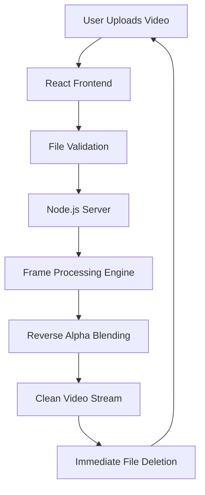

# Gemini Veo Video Watermark Remover

[](https://opensource.org/licenses/MIT)
[](https://nodejs.org/)
[](https://ffmpeg.org/)
[](https://vercel.com/)
[](https://railway.app/)

---

## 📌 Project Overview

**Gemini Veo Video Watermark Remover** is a full-stack, privacy-focused application designed to remove visible watermarks from AI-generated videos.  
It is specifically optimized for videos generated by modern AI platforms where watermarks are applied as semi-transparent overlays.

Unlike browser-based solutions that rely on heavy client-side computation or simple blur/crop techniques, this project processes videos **server-side** using a controlled and optimized video pipeline to ensure:

- High visual quality
- Accurate watermark removal
- Safe handling of large video files
- Minimal client resource usage

---

## 🎯 Problem Statement

AI-generated videos often include visible watermarks to indicate origin or ownership. These watermarks:

- Are blended into video frames using transparency
- Cannot be cleanly removed using cropping without losing content
- Look visually degraded when blurred or inpainted

Most online tools sacrifice quality or fail on large videos.  
This project addresses those limitations by applying **pixel-level mathematical restoration** instead of visual masking.

---

## 🧠 Core Algorithm: Reverse Alpha Blending

### 🔹 How Watermarks Are Applied

Watermarks are typically added using **alpha compositing**, where the watermark is blended with the original frame.

Mathematically:

```math
R = αW + (1 − α)O
```

Where:
- **R** → Resulting (watermarked) pixel
- **α** → Transparency level of the watermark
- **W** → Watermark pixel value
- **O** → Original pixel value

This operation is applied to every pixel in the watermark region across all frames.

---

### 🔹 How This Project Removes the Watermark

Instead of hiding the watermark, the system **reverses the blending equation** to recover the original pixel.

```math
O = (R − αW) / (1 − α)
```

### ✅ Key Advantages of This Method

- Restores original texture and color
- Avoids blur, smudging, or artifacts
- Maintains sharp edges and details
- Produces visually consistent frames

Each video frame is treated as a grid of pixels, and the algorithm is applied **frame-by-frame** in the watermark region.

---

## 🛠 Video Processing Pipeline

The application uses a structured server-side pipeline to safely handle heavy video workloads.



### 🔹 Pipeline Characteristics

- Stream-based processing (no full memory load)
- Temporary filesystem usage only
- Automatic cleanup after processing
- Cloud-compatible execution

---

## 🔐 Privacy & Security Model

This project is designed with **privacy-first principles**:

- Videos are stored only in temporary directories
- Files are deleted immediately after processing
- No user data is logged or stored
- No database is used

### Security Controls

- Strict MIME-type validation (`video/*`)
- Filename sanitization to prevent injection
- Controlled FFmpeg execution
- Environment-safe path handling

---

## 💻 Technology Stack

### Backend (Core Engine)
- **Node.js** – Runtime environment
- **Express.js** – API handling
- **FFmpeg** – Frame-level video processing
- **fluent-ffmpeg** – FFmpeg orchestration
- **Multer** – Secure video uploads

### Frontend (Interface)
- **React.js** – User interface
- **Tailwind CSS** – Modern styling
- **Vercel** – Frontend hosting

---

## ⚠️ Technical Limitations

- Maximum supported file size: **50MB**
- Designed for **visible, overlay-based watermarks**
- Assumes watermark position is static
- Extremely long or 4K videos may hit free-tier limits

Invisible forensic watermarks (e.g., metadata or cryptographic markers) are **not supported**.

---

## ⚖️ Ethical & Legal Disclaimer

This project is intended strictly for:

- Educational purposes
- Research and experimentation
- Demonstration of signal processing concepts

Users are solely responsible for:
- Complying with platform terms of service
- Respecting content ownership and attribution

The author does **not** endorse misuse, deception, or unethical application of this software.

---

<div align="center">

**Developed by Husnain Mazhar**  
GitHub • LinkedIn

</div>
