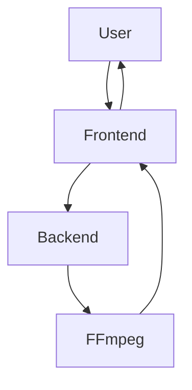

# Gemini Veo Video Watermark Remover

[](https://opensource.org/licenses/MIT)
[](https://nodejs.org/)
[](https://ffmpeg.org/)
[](https://vercel.com/)
[](https://railway.app/)

**Gemini Veo Video Watermark Remover** is a secure, full-stack application designed to remove visible watermarks from AI-generated videos.
It uses server-side video processing to deliver clean, high-quality results even for large files.

Unlike browser-only tools that struggle with performance and memory limits, this project leverages a **Node.js + FFmpeg** backend for fast, frame-accurate watermark removal.

---

## 🚀 Key Features

- Server-side video processing (MP4, MOV, MKV)
- Handles files up to 50MB
- Stream-based, high-performance processing
- Privacy-first: temporary storage only, instant deletion
- No database, no logs, no permanent storage
- Secure MIME-type validation and filename sanitization

---

## 🧠 Core Algorithm: Reverse Alpha Blending

```math
R = αW + (1 − α)O
```

```math
O = (R − αW) / (1 − α)
```

This approach preserves sharpness and avoids blur or cropping artifacts.

---

## 🛠 System Architecture



---

## 💻 Technology Stack

**Backend:** Node.js, Express.js, FFmpeg, Multer  
**Frontend:** React.js, Tailwind CSS, Vercel  

---

## ⚡ Getting Started

### Backend
```bash
cd backend
npm install
npm start
```

### Frontend
```bash
cd frontend
npm install
npm run dev
```

---

## 🔌 API Reference

**POST /process-video**  
Uploads a video and returns the processed output stream.

---

## ⚠️ Limitations

- Max file size: 50MB
- Visible watermarks only
- Static watermark position required

---

## ⚖️ Disclaimer

This project is for educational and research purposes only.
Users are responsible for compliance with platform policies.

---

**Developed by Husnain Mazhar**
